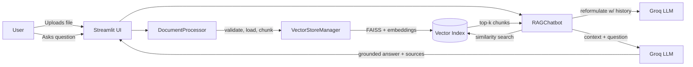

# 📚 DocuMind — Enterprise Document Intelligence Assistant

[](https://github.com/Gayathri-Reddy874/documind-rag-assistant/actions/workflows/ci.yml)
[](https://www.python.org/)
[](https://streamlit.io/)
[](LICENSE)

A production-structured **Retrieval-Augmented Generation (RAG)** chatbot that lets you upload documents (PDF, DOCX, TXT, CSV, Markdown) and ask natural-language questions about them — grounded, cited answers powered by **Groq's LPU inference** for near-instant responses.

Built with a clean, layered architecture (config → ingestion → vector store → LLM chain → UI) so each piece is independently testable, swappable, and container-ready.

---

## ✨ Features

- **Multi-format ingestion** — PDF, DOCX, TXT, Markdown, and CSV, with per-file validation (type, size, empty-content checks).
- **Conversational memory** — follow-up questions are automatically reformulated into standalone queries using chat history (no more "what did you mean by that?").
- **Source-grounded answers** — every response links back to the exact document chunks it was generated from, shown inline in the UI.
- **Groq-powered inference** — swap between `llama-3.3-70b-versatile`, `llama-3.1-8b-instant`, and `mixtral-8x7b-32768` from the sidebar.
- **Local, private vector search** — FAISS + Sentence-Transformers embeddings run entirely on your machine; documents never leave your environment except for the LLM call itself.
- **Persistence-ready** — vector indices can be saved/loaded per session for reuse across restarts.
- **Enterprise-grade error handling** — typed, domain-specific exceptions surfaced as clear UI messages instead of stack traces.
- **Fully tested & CI'd** — unit tests with mocked dependencies, linting (ruff + black), and a GitHub Actions pipeline that also builds the Docker image.
- **Container-first** — multi-stage `Dockerfile`, non-root user, health checks, and a ready-to-go `docker-compose.yml`.

---

## 🏗️ Architecture



### Project structure

```
documind-rag-assistant/
├── app.py                      # Streamlit UI (entry point)
├── src/
│   ├── config.py                # Pydantic settings, env-driven
│   ├── logging_config.py        # Centralized logging setup
│   ├── exceptions.py            # Domain-specific exception types
│   ├── document_processor.py    # Load, validate, chunk documents
│   ├── vector_store.py          # FAISS index build/persist/query
│   └── rag_chain.py             # LCEL conversational RAG chain (Groq)
├── tests/
│   ├── test_document_processor.py
│   └── test_vector_store.py
├── .github/workflows/ci.yml     # Lint, test, Docker build
├── Dockerfile                   # Multi-stage, non-root, healthcheck
├── docker-compose.yml
├── requirements.txt
├── requirements-dev.txt
├── pyproject.toml               # ruff / black / pytest / mypy config
├── .env.example
└── LICENSE
```

---

## 🚀 Getting started

### 1. Clone & set up a virtual environment

```bash
git clone https://github.com/Gayathri-Reddy874/documind-rag-assistant.git
cd documind-rag-assistant
python -m venv .venv
source .venv/bin/activate      # Windows: .venv\Scripts\activate
```

### 2. Install dependencies

```bash
pip install -r requirements.txt
```

### 3. Configure environment variables

```bash
cp .env.example .env
# Edit .env and add your GROQ_API_KEY (free key at https://console.groq.com)
```

### 4. Run the app

```bash
streamlit run app.py
```

Open **http://localhost:8501**, upload a document from the sidebar, click **Process documents**, and start asking questions.

---

## 🐳 Run with Docker

```bash
docker compose up --build
```

The app will be available at **http://localhost:8501**. Vector indices persist to `./data/vector_store` on the host via a mounted volume.

---

## 🧪 Testing & code quality

```bash
pip install -r requirements-dev.txt

ruff check src tests app.py      # lint
black --check src tests app.py   # formatting
pytest --cov=src                 # unit tests + coverage
```

All three run automatically in CI on every push and pull request to `main`.

---

## ⚙️ Configuration reference

All settings are environment-driven (see `.env.example`) and validated at startup via Pydantic:

| Variable | Default | Description |
|---|---|---|
| `GROQ_API_KEY` | — | Your Groq API key (required) |
| `GROQ_MODEL` | `llama-3.3-70b-versatile` | Groq-hosted generation model |
| `LLM_TEMPERATURE` | `0.2` | Sampling temperature |
| `EMBEDDING_MODEL` | `sentence-transformers/all-MiniLM-L6-v2` | HuggingFace embedding model |
| `CHUNK_SIZE` / `CHUNK_OVERLAP` | `1000` / `150` | Text splitting parameters |
| `RETRIEVER_TOP_K` | `4` | Number of chunks retrieved per query |
| `MAX_UPLOAD_MB` | `25` | Per-file upload size limit |

---

## 🗺️ Roadmap

- [ ] Swap FAISS for a managed vector DB (Pinecone / Qdrant) behind the same `VectorStoreManager` interface
- [ ] Add streaming token-by-token responses in the UI
- [ ] Multi-user auth and per-user document namespaces
- [ ] Evaluation harness (RAGAS) for answer faithfulness and retrieval precision

---

## 🤝 Contributing

Issues and pull requests are welcome. Please run `ruff`, `black`, and `pytest` locally before opening a PR — the CI pipeline enforces all three.

---

## 📄 License

Released under the [MIT License](LICENSE).
